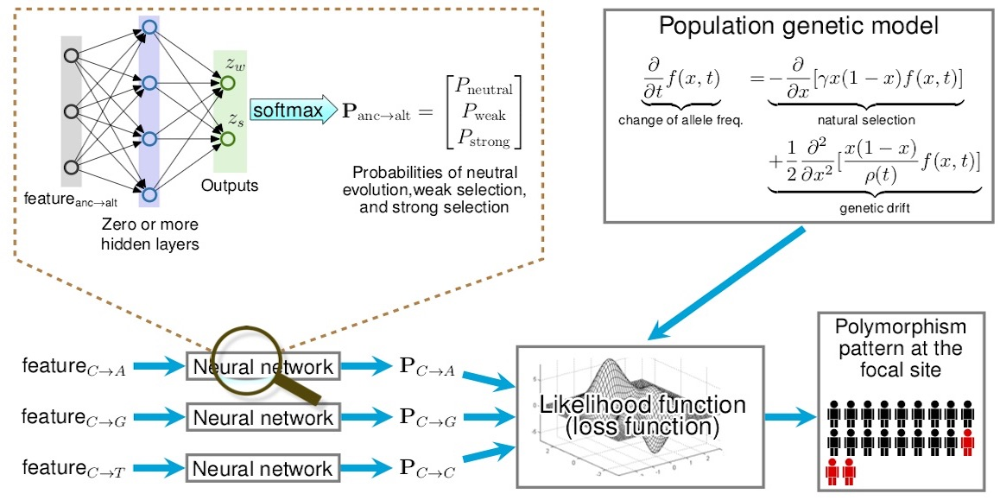
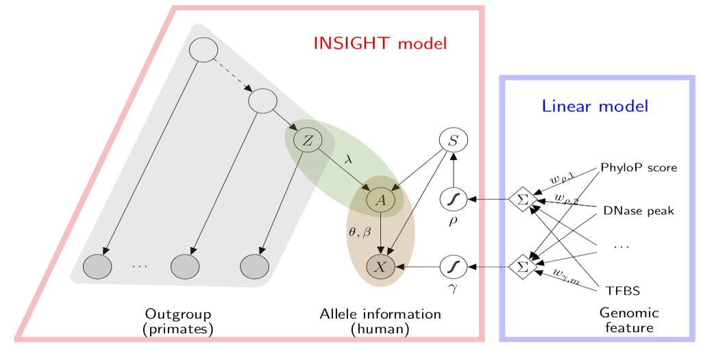
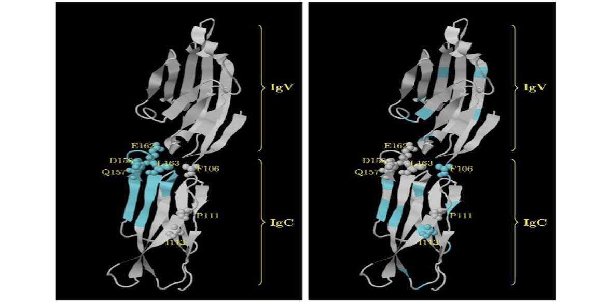

## Research
Millions of genetic variants have been identified in human genomes and the
catalog of genetic variation is still expanding rapidly due to the continual
drop of sequencing costs. Understanding the functional, clinical, and
evolutionary significance of genetic variants has become a central question in
biology and precision medicine. 
However, it is very challenging to distinguish important variants from neutral ones.
Therefore, many genetic variants in patients' genomes are marked as "variant of
uncertain significance", forming a major hurdle for both basic research and
medical practice.

We are interested in addressing the problem of "variant of uncertain significance" 
by unifying evolutionary biology and machine learning. Our research is motivated
by the insight that evolution operates like a high-throughput mutagenesis experiments:
deleterious mutations are quickly purged from 
populations due to natural selection, which in turn leaves detectable marks on human genomic sequences.
We have developed multiple machine learning and statistical frameworks 
to identify these signatures of deleterious variants from population and functional genomic data.
Not only have our computational methods provided useful insights on human evolution but also been applied
to prioritize causal variants associated with human genetic disorders.

#### Estimation of selection coefficients associated with human coding variants 

A central challenge in human genomics is to understand the cellular, evolutionary, and clinical significance
of genetic variants. We recently developed a unified population-genetic and machine-learning model,
called Linear Allele-Specific Selection InferencE (LASSIE), for estimating the fitness effects of all potential
single-nucleotide variants, based on polymorphism data and predictive genomic features. We applied
LASSIE to 51 high-coverage genome sequences annotated with 33 genomic features, and constructed a
map of allele-specific selection coefficients across all protein-coding sequences in the human genome. This
map is generally consistent with previous inferences of the bulk distribution of fitness effects, but reveals
pervasive weak negative selection against synonymous mutations. In addition, the estimated selection coefficients
are highly predictive of inherited pathogenic variants and cancer driver mutations, outperforming
state-of-the-art variant prioritization methods. By contrasting our estimated model with ultra-high coverage
ExAC exome-sequencing data, we identified 1,118 genes under unusually strong negative selection, which
tend to be exclusively expressed in the central nervous system or associated with autism spectrum disorder,
as well as 773 genes under unusually weak selection, which tend to be associated with metabolism. This
combination of classical population genetic theory with modern machine-learning and large-scale genomic
data is a powerful paradigm for the study of both human evolution and disease.

#### Scalable prediction of deleterious noncoding mutations in the human genome

Many genetic variants that influence phenotypes of interest are located outside of protein-coding genes, yet existing methods for identifying such variants have poor predictive power. Recently, we developed a new computational method, called LINSIGHT, that substantially improves the prediction of noncoding nucleotide sites at which mutations are likely to have deleterious fitness consequences, and which, therefore, are likely to be phenotypically important. LINSIGHT combines a generalized linear model for functional genomic data with a probabilistic model of molecular evolution. The method is fast and highly scalable, enabling it to exploit the "big data" available in modern genomics. We show that LINSIGHT outperforms the best available methods in identifying human noncoding variants associated with inherited diseases. In addition, we apply LINSIGHT to an atlas of human enhancers and show that the fitness consequences at enhancers depend on cell type, tissue specificity, and constraints at associated promoters.

#### Statistical phylogenetic models for inferring functional protein patches

A variety of statistical phylogenetic models have been developed to predict functionally important protein sites, e.g. ligand binding sites or protein-protein interaction interfaces, by comparing sequences from different species. However, most of the existing methods ignore the spatial clustering of functionally important sites in protein tertiary/primary structures, which significantly reduces their power to identify functionally important regions in proteins. We developed several new statistical phylogenetic models for inferring functionally important protein regions in which Gaussian processes or hidden Markov models are used as prior distributions to model the spatial correlation of evolutionary patterns in protein tertiary/primary structures. Both simulation studies and empirical data analyses suggest that these new models outperform classic phylogenetic models. Therefore, these new models may be useful tools for extracting functional insights from protein sequences and for guiding mutagenesis experiments. Furthermore, the new methodologies developed in these models may also be used in the development of new statistical models to answer other important questions in phylogenetics and molecular evolution.

